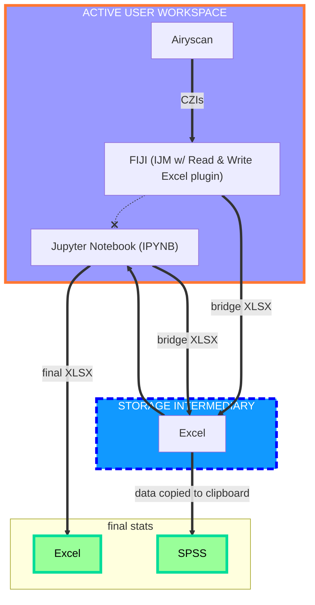

# Custom-Img-Analysis-Pipeline
I will be improving my original data pipeline that I used for my master's project using realistic test data. The pipeline is structured slightly inefficiently to accommodate for project adjustments, and I want to create a more seamless pipeline now that the order of operations has been established.

_**GOAL: clean up Python scripts and eliminate the need for more than 1 intermediary Excel file within the pipeline**_

# $\color{blue}{\text{Folders}}$

1. $\color{Turquoise}{\text{Raw FIJI Test Data - Snapshots}}$ : samples of raw image data to be processed in the pipeline
2. $\color{aquamarine}{\text{Primary Processing}}$ :
   - Python scripts that import the raw image data to Jupyter Notebook and export the processed results to Excel
   - CSV files showing the exported results that were sent to each Excel sheet

4. $\color{Gold}{\text{Final Analysis}}$ :
   - Python scripts that import the previously processed results (the exports from Primary Processing) to Jupyter Notebook and export the final statistical analysis to Excel
   - CSV files showing the final exported statistical findings that were sent to each Excel sheet

# The Pipeline

Software Workflow

